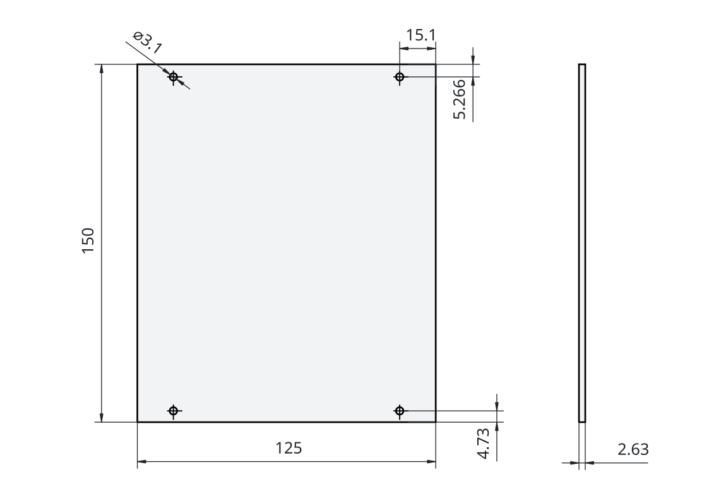

# 空プレート

Ardeckはボディーとプレートに分離されています。スイッチを変更するたびに毎回大きなボディを作成する手間を省くためです。プレートは各個人がそれぞれの用途や好みにあわせて簡単に作成することができます。

## 寸法図

## 設計するにあたっての注意点

- スイッチ類を設置するための穴をあける際、**上下約10mm以上は空けておくこと**。
- 配線時を考慮して、あまりにも多くのスイッチを配置しないこと。
  - 参考として、メカニカルスイッチを21個以上配置する場合、さらに大きなボディを設計する必要があります。
